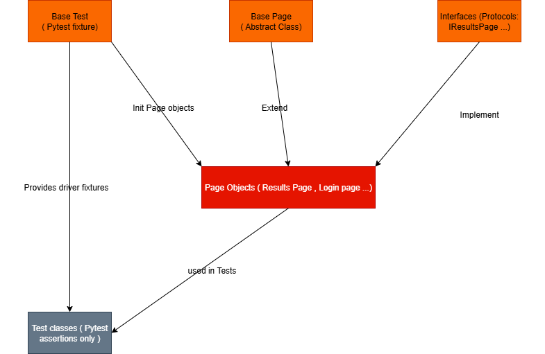

# Selenium Test Automation Framework 

## 1. Objective

Design a scalable Selenium automation framework, aligned with clean architecture principles, fully compatible with Jenkins Docker Selenium images, and able to run in headless mode for CI/CD pipelines.

## 2. Design Principles

- **Abstraction** – Shared logic centralized in abstract classes and pytest fixtures (`BasePage`, `driver` fixture).

- **Interface-Driven** – Each Page Object implements a Python `Protocol` (for example `IResultsPage`) defining expected behaviors.

- **Encapsulation & DRY** – Page Objects encapsulate locators and actions, avoiding duplication across tests.

- **Test Focus** – Test files contain only assertions, not setup/driver management.(as the requirements)

## 3. Framework Architecture 

- **Pytest Runner**
  - Handles discovery of tests, fixtures, reporting (using JUnit).

- **BaseTest (pytest fixtures)**
  - Fixture `driver()` manages WebDriver lifecycle (setup/teardown).
  - Fixture `pages()` initializes Page Objects and provides them to tests.

- **BasePage (Abstract Class)**
  - Encapsulates common actions like (`click`, `type`, `wait_visible`, `wait_clickable`....).
  - Handles explicit waits and retries for stability.

- **Interfaces (Contracts)**
  - Defined with `typing.Protocol`, specifying what each Page Object should implement for example (`get_title()`, `get_naics()`).

- **Page Objects**
  - Implement their interface, inherit from `BasePage`.
  - Encapsulate locators and page-specific actions ( wit no assertions).

- **Tests**
  - Consume pytest fixtures, use Page Objects, contain only assertions.


## 4. Example Test Case ( Could be changed or improved if needed)

- **Scenario:** Navigate to [psc/1510](https://psctool.us/psc/1510).
- **Expected:** Verify that the NAICS Code equals **336411** and the title equals **"aircraft, fixed wing"**.
- **Approach:** Locator encapsulated in Page Object → Assertion in Test class.

### Locator Strategy
- Prefer **CSS/XPath** selectors based on unique, stable attributes (`data-testid`, `aria-*` with normalized text).
- Fallback: relative locators anchored to semantic elements.
- Guards: explicit waits, uniqueness checks, visibility checks.

```python
# Example selectors (inside Page Object)

TITLE = (By.XPATH, "//h1[normalize-space()='aircraft, fixed wing']")
NAICS = (By.CSS_SELECTOR, "[data-testid='naics-code'], .naics-code")
````

### Example Test (pytest, assertions only)

```python
def test_title_and_naics(results_page):
    assert results_page.get_title() == "aircraft, fixed wing"
    assert results_page.get_naics() == "336411"
```


## 5. CI/CD & Scalability

* **Headless Execution:** Enabled with Chrome flags ( Possible with groovy language).
* **Docker/Jenkins:** Runs in `selenium/standalone-chrome` container or Selenium Grid.
* **Configuration via env vars: (file will be not pushed to github)** 

  * `BASE_URL=https://psctool.us/psc/1510`
  * `HEADLESS=true`
  * `BROWSER=chrome`
* **Reporting:** JUnit XML on failure / success .
* **Scalability:** Adding a new page = define a `Protocol` + implement Page Object. Existing tests remain unchanged.


## 6. Reliability & Maintainability

* **Test Data:** Externalized (CSV/JSON) for reusability.
* **Logging:** Info by default, Debug toggle via env var.
* **Parallelization:** `pytest -n auto` to accelerate suite execution. ( should ask how many threads in VM machine)
* **Evolutivity:** Add new Page Objects/tests without modifying framework core.


## 7. Diagram

The following diagram shows how the framework components interact following the Page Object Model with pytest:

- **Base Test (fixture)**: manages WebDriver lifecycle and provides PageObjects.  
- **Base Page**: common actions (click, type, wait) shared across all pages.  
- **Interfaces (Protocols)**: define contracts each PageObject must implement.  
- **Page Objects**: encapsulate locators and actions, implement interfaces.  
- **Test Classes**: use PageObjects and contain assertions only.  

This ensures clean separation of concerns, DRY code, and scalability in CI/CD pipelines.





## 8. Compliance with Design Rules

* [x] Page Objects implement an **interface** (`Protocol`).
* [x] Shared behaviors are abstracted into **BasePage**.
* [x] Tests inherit from **BaseTest** fixture pattern, no duplication of setup.
* [x] Test methods focus **only on assertions**.
* [x] Framework runs **headless in CI/CD** with proper reporting.


## 9. License

This project is licensed under the MIT License – you are free to use, modify, and distribute it with attribution.
See the  file for more details.